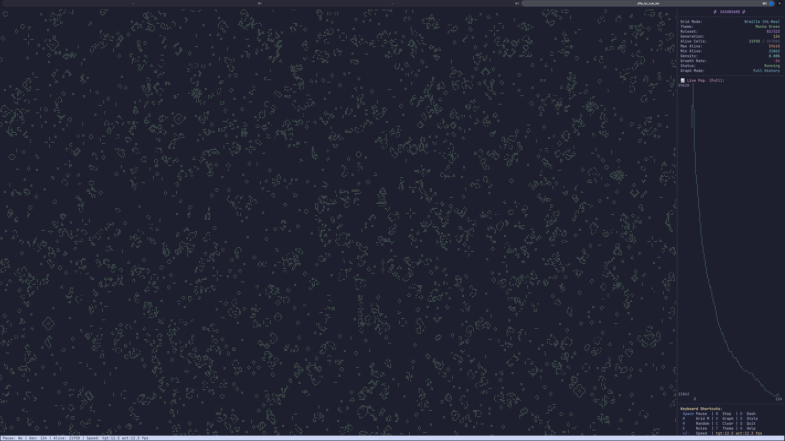
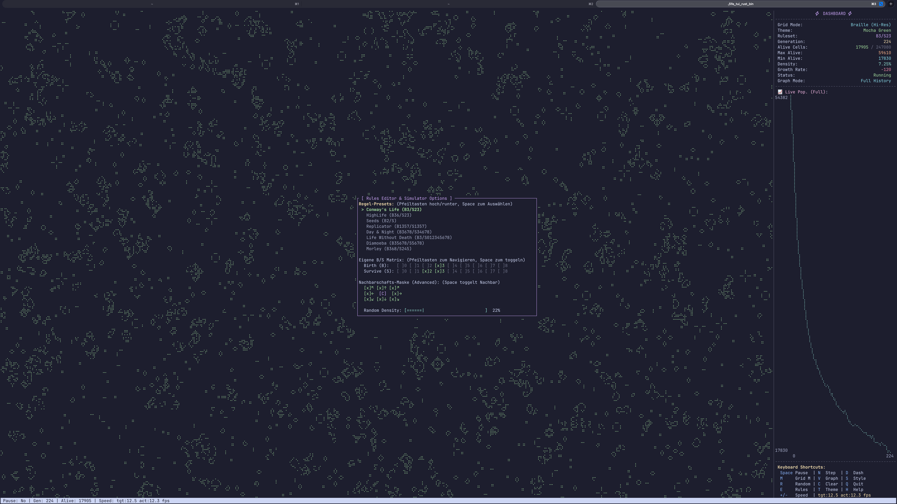
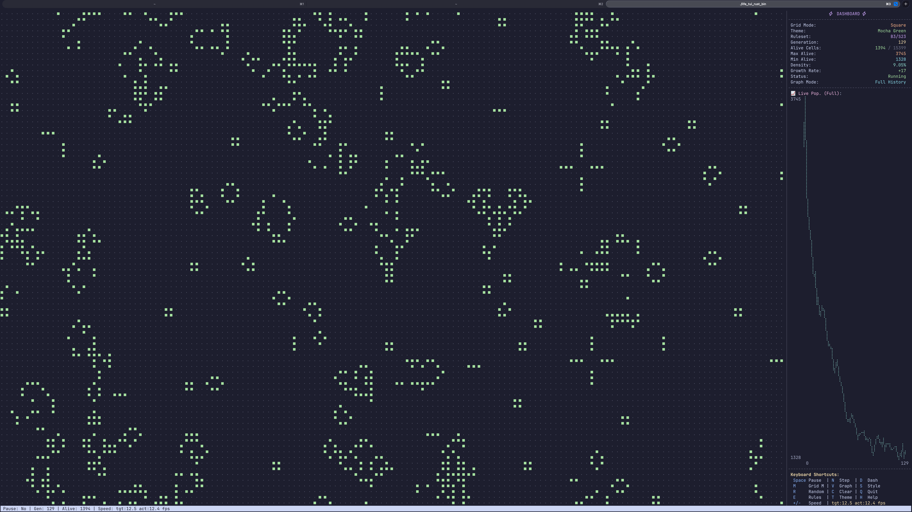
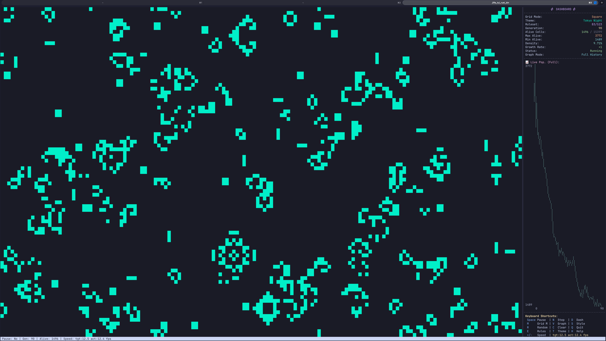
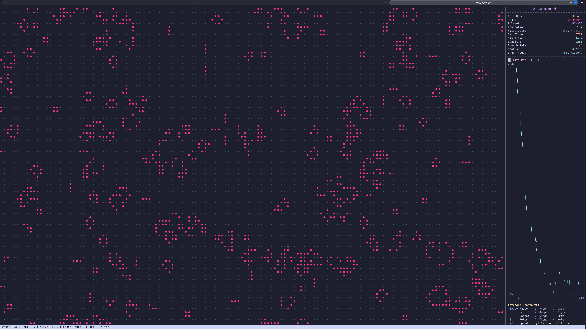
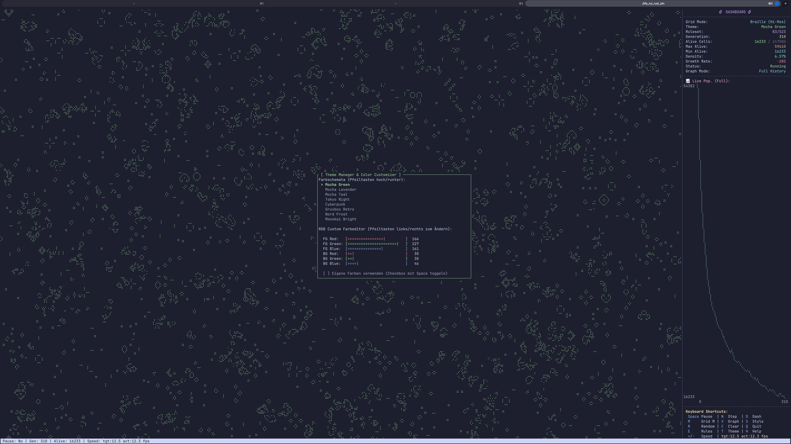
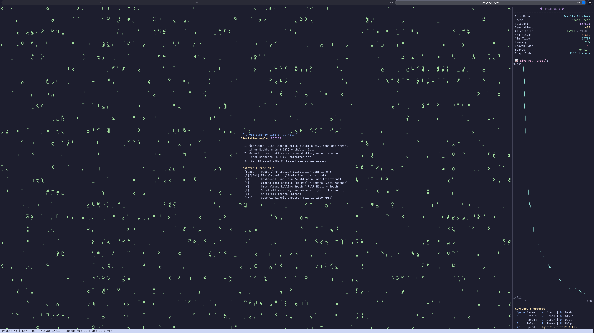

# life_tui_rust

A highly optimized, multi-threaded implementation of Conway's Game of Life (and other cellular automata) featuring a modern Terminal User Interface (TUI). Built in Rust using `ratatui` and `crossterm`.

Designed to deliver raw performance, hitting up to 1000+ generations per second by utilizing lock-free data parallelization.

<p align="center">
  
  
</p>

<p align="center">
  <i>Left: High-performance simulation in Braille (Hi-Res) mode. Right: Interactive Rules Editor with custom neighborhood masks.</i>
</p>

---

## ⚡ Features

- **🚀 Multithreaded Processing:** Uses `rayon` to split cellular updates row-by-row across all available CPU threads (supports hybrid/hyperthreaded cores like M1 Max or Core i9).
- **📟 High-Resolution Rendering:** Toggles between standard `Square` cells and hi-res `Braille` canvas mode (sub-pixel resolution).
- **⏱️ Live Performance Benchmark:** Features target vs. actual de-facto generations-per-second (FPS) counters. Support for `0 ms` delay (unbounded CPU benchmark mode).
- **📈 Interactive Dashboard:** Includes a rolling or full history population graph, live simulation metrics, active rules, and an aligned shortcuts legend.
- **🛠️ Ruleset Editor:** Custom B/S rules Preset list (Conway, HighLife, Seeds, Morley, etc.), interactive 1D Birth/Survive matrix, and a **3x3 Neighborhood Mask** to toggle Moore vs. von Neumann neighborhoods.
- **🎨 Theme Manager:** Choose from curated preset themes (Catppuccin Mocha, Tokyo Night, Cyberpunk, Gruvbox, etc.) or customize RGB foreground/background colors interactively with built-in sliders.
- **🎬 Dashboard Slide Animation:** Smooth exponential slide-in and slide-out transition for the dashboard panel.

---

## 🎹 Keyboard Shortcuts

| Key | Action |
| :--- | :--- |
| **`Space`** | Pause / Resume simulation |
| **`N`** / **`Enter`** | Trigger a single step (when paused) |
| **`+`** / **`-`** | Adjust delay (Speed up to `max` / 0 ms / down to 1000 ms) |
| **`R`** | Re-populate grid randomly (based on custom density) |
| **`C`** | Clear grid and reset statistics |
| **`D`** | Toggle Dashboard Panel (slide transition) |
| **`M`** | Toggle render mode: Braille (Hi-Res) vs. Square |
| **`V`** | Toggle Graph mode: Rolling vs. Full History |
| **`S`** | Switch to the next preset theme |
| **`E`** | Open Ruleset Editor (Presets, Custom rules, Neighborhood Mask, Random Density) |
| **`T`** | Open Theme Manager (Preset themes, Custom RGB FG/BG color sliders) |
| **`H`** / **`?`** | Open Help popup (Game of Life rules and info) |
| **`Q`** / **`Esc`** | Quit the program |

---

## 🛠️ Building & Running

Ensure you have the Rust compiler installed on your system.

### Build Optimized Universal Binary (macOS Intel + Apple Silicon)
To compile a native optimized binary that runs on both Intel-based and Apple Silicon Macs:

```bash
# Add targets
rustup target add x86_64-apple-darwin aarch64-apple-darwin

# Build for Intel
RUSTFLAGS="-C target-cpu=native" cargo build --release --target x86_64-apple-darwin

# Build for Apple Silicon
RUSTFLAGS="-C target-cpu=apple-m1" cargo build --release --target aarch64-apple-darwin

# Merge into a Universal Binary
lipo -create -output life_tui_rust_bin \
  target/x86_64-apple-darwin/release/life_tui_rust \
  target/aarch64-apple-darwin/release/life_tui_rust
```

### Run Locally
To run the local version directly on your machine:
```bash
cargo run --release
```

---

## 📷 UI Gallery & Theme Showcase

### Grid Modes: Hi-Res Braille vs. Classic Square
Compare the sub-pixel rendering resolution of the Braille mode against the classic square block cells:

| Braille Mode (Hi-Res - 247k+ grid cells) | Classic Square Mode (15k+ grid cells) |
| :---: | :---: |
|  |  |

### Curated Themes
The terminal interface supports multiple built-in color palettes to match your terminal setup:

| Tokyo Night Theme | Cyberpunk Theme |
| :---: | :---: |
|  |  |

### Interactive Overlays
Control every parameter of the simulation without leaving the terminal using clean, user-friendly menu screens:

| Rules Editor | Theme Manager & Color Customizer | Help & Instructions |
| :---: | :---: | :---: |
|  |  |  |

---

## 👥 Authors

- **Stefan** ([@metawops](https://github.com/metawops)) - Developer & Architect
- **Antigravity** ([@google-antigravity](https://github.com/google-antigravity)) - Co-Author & AI Programming Companion

---

## 📄 License

This project is licensed under the MIT License - see the [LICENSE](LICENSE) file for details.
